# 우아한 길 (우리 아이 안전한 길)(2018.07.01 ~ 2018.8.30)
---

### 1. 개요 

요즘 어린 아이들의 사건 사고가 많아 서울시 대상으로 주변 지역의 안전한 정도를 측정하기 위한 지도를 만들고 싶었다.

python으로 수집, 전처리, 분석, 기계학습 + flask까지 사용하며 만들게 되었다.

### 2. 담당한 부분
 
모든 부분 ( 기획, 데이터 수집, 데이터 전처리, 데이터 분석, 시각화, 시스템(프론트엔드, 백엔드) + 여러 API 사용까지 )
 
### 3. 개발 환경
 
 Flask + bootstrap + Nginx + python(3.6)[selenium, pandas, scikit-learn ..] + API ( 공공데이터, 좌표 변환, 도로명 주소 변환, Daum 지도, T맵, 구글 지도) ..
 
### 4. 느낀점
 
#### - 개발 이외의 부분
 
 통계적인 부분을 하나도 몰라서 인사이트적인 부분과 개념을 익히는데 좀 힘들었다.
 
 
 
#### - 개발에 대한 부분
 
 모든것을 처음 배우고 처음 사용하다 보니 진행속도가 더딤.
 
 selenium 같은 경우는 생각보다 시간 소비가 많이 걸려서 아쉬웠다. 일일이 클릭하고 가져오기 때문에 2~3개 자료를 수집하는데 1초 정도 걸리는것 같았다.
 
 서울시 공공데이터가 생각보다 많이 부실함.(잘못된 데이터가 너무 많음)
 
 도로명 주소가 없는 경우도 있었다. 지번으로는 뜨는데 도로명은 없다.
 
 그래서 좌표를 변환하는데 어려움을 겪음. 좌표 변환 api도 정확하지 않아 다른곳에 찍히는 경우도 많다.
 
 또한 처음에 범죄 데이터를 동별로 구하기 위해서 31개의 경찰서에 문의와 전화를 드렸으나 집값과 개인정보 때문에 즉 법때문에 받을 수 없다는 답변을 받았다. 우리나라가 4차 산업을 이끌려면 이런 정보들도 오픈을 해야하지 않을까라는 생각을 많이 하게 되었다.
 
 이러한 더러운 값들을 모아 pandas로 전처리를 해주었다. 수집한 데이터가 약 100만개로 이상한 데이터를 많이 지우고, 좌표같은 경우는 합치고 mashup 시키다 보니 자료가 총 60만개로 줄어들었다.
 
 이 과정에서 자료 수집을 최대한 많이 해야 잘못된 자료가 있을때 어떻게 할지의 선택지가 많아진다는것을 알았다.
 
 이후 분석 과정에 있어서는 통계적인 인사이트가 부족하여 모든 통계적 분석을 진행 해보았다.
 
 어느 동에 어느 요소가 많은지 ..
 
 이후 상관 분석을 하여 관계 있는것 끼리는 합쳐주었다.
 
 예를 들어 초등학교의 경우 병설유치원이 많아 유치원과 초등학교의 상관 관계가 높게 나왔다. 이런 경우 합쳐주었는데 이유는 Multicollinearity Problem
문제 때문이다. 

Logistic regression 의 경우 독립변수들 간의 상관관계가 거의 없어야 의미가 있는것이기 때문에 분석이 잘 안된다.

그래서 관련있는 Feature들을 합치고 분석을 진행하였더니 Logistic의 경우 약 84%정도의 정확도를 나타내었다. (학습 셋과 테스트 셋을 약 70% 30%으로 나누어 진행하였다.) 상당히 높은 수치여서 overfitting이 되었을까봐 cross validation을 진행해보았는데도 평균이 약 83%로 우수했다.

이후 Learning Curve, Confusion matrix , Classification report , Precision_recall , Roc 등 검증에 힘을 썼고 결과가 나쁘지 않았다.

이후 앙상블 모델 중 Bagging 을 적용한 모델 RandomForestClassifier 과 boosting 방법을 적용한 GradientBoostingClassifier 도 똑같은 순서로 검증을 해보았는데 Logistic Regression이 가장 정확도가 높았다. 

이것으로 데이터 셋들이 선형의 모습을 띈다는 것을 유추할 수 있었다.

이 분석 모델을 바탕으로 DB에 저장된 데이터들을 이용하여 실시간 안전 등급을 매겨주는 지도 시스템을 Flask로 구현했다.

지도 중앙에서 중심원 반경 안에 들어가 있는 각 요소들의 숫자들을 분석 모델에 넣어 '안전', '주의', '위험' 등 3가지로 나누어 결과 값을 보여주었다.

지도를 구현 할 때 처음에는 Daum 지도를 사용했지만 우리 기능에서 길찾기도 중요한 기능이였기 때문에 T map으로 갈아타게 되었다.

T map은 다 좋았지만 검색 성능이 많이 좋지 못해 검색 부분은 Daum api로 구현했다.

또한 현재 위치의 경우에는 구글 map에서 제공해주는 api를 사용하여 지도에서만 총 3개의 api를 mashup시켰다.

구글 현재 위치의 경우 https 즉 SSL 보안서가 있는 홈페이지에서만 적용이 되어 애를 먹었다. (로컬 환경은 그냥 된다.)

### 5. 구동 사진 (핸드폰)

##### 소개 페이지1

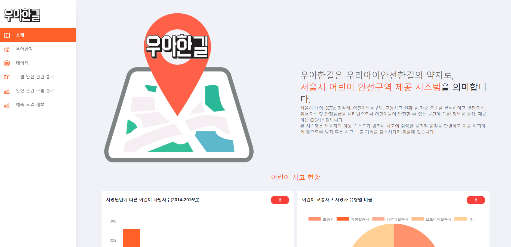

##### 소개 페이지2

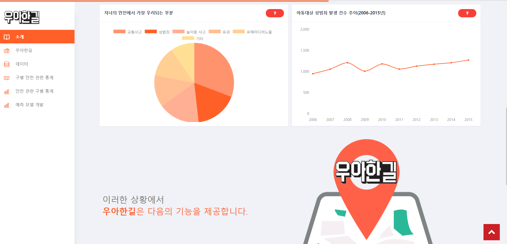

##### 소개 페이지3

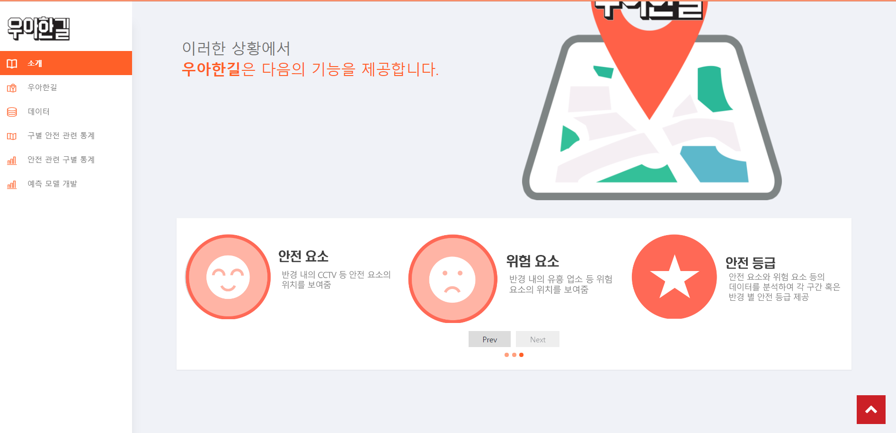

##### 메인 페이지1

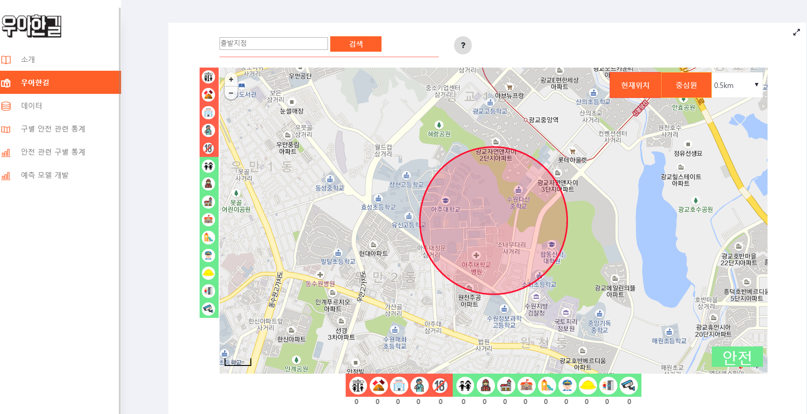

##### 메인 페이지2

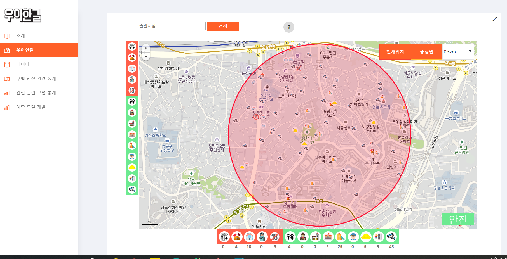

##### 메인 페이지3

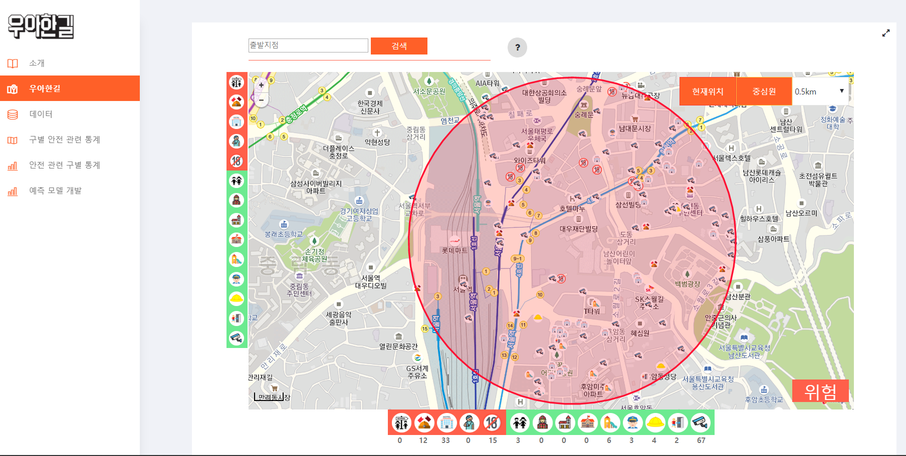

##### 데이터 페이지

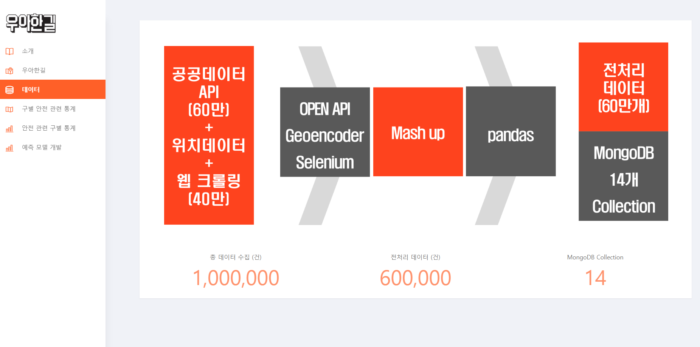

##### 통계 페이지

##### 통계 페이지2

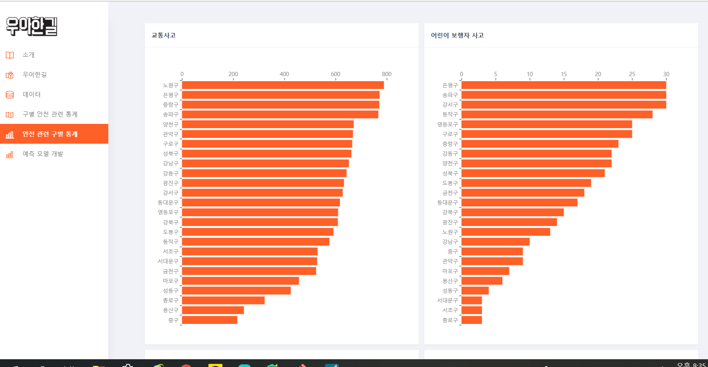

##### 분석 페이지

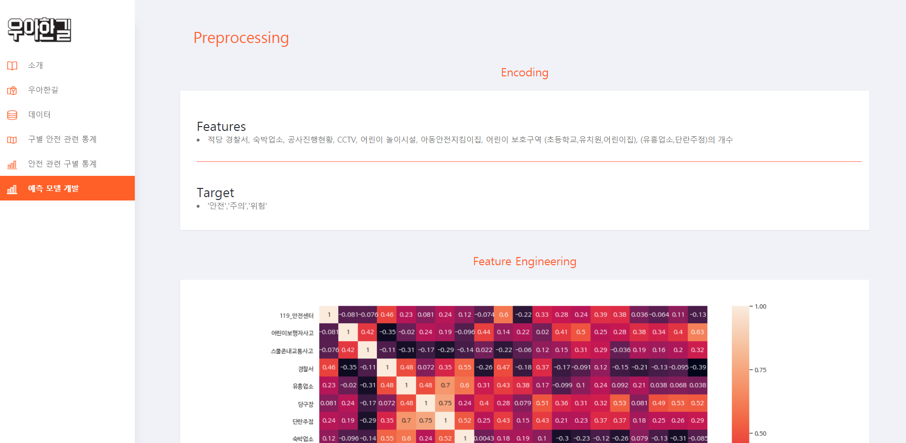

##### 분석 페이지2

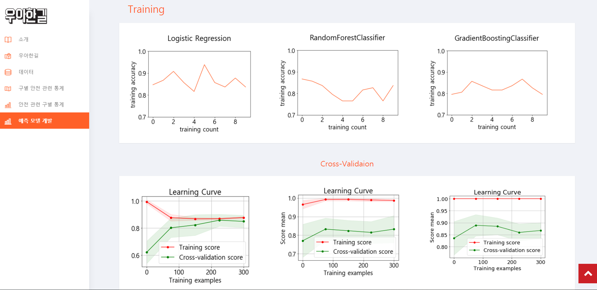

##### 분석 페이지3

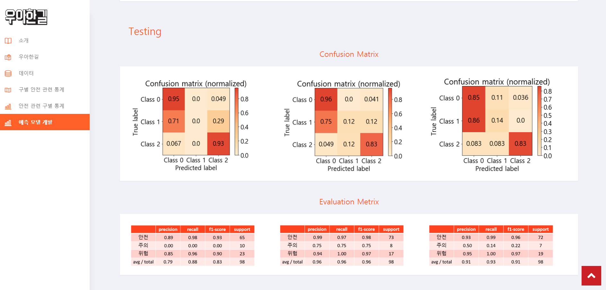

##### 분석 페이지4

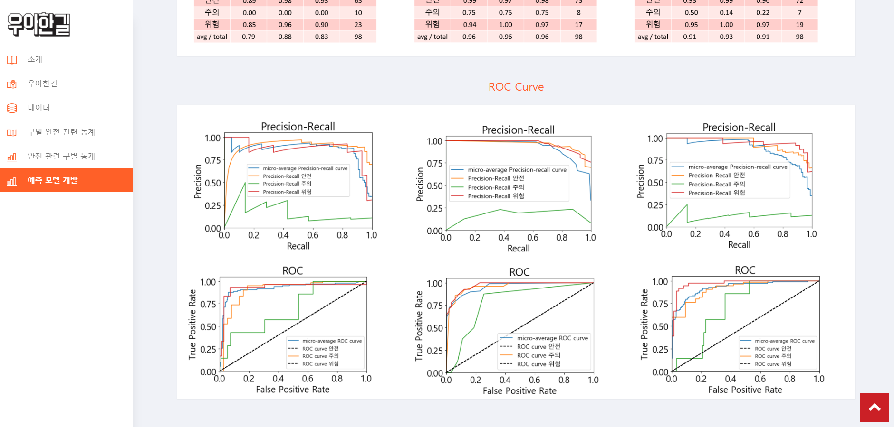

### 6. 간략한 사용자 시나리오

메인 페이지 ( 지도 ) 에서 자신의 동을 검색 하여 주변 반경의 위험 요소들과 그 지역의 위험도를 볼 수 있다.
